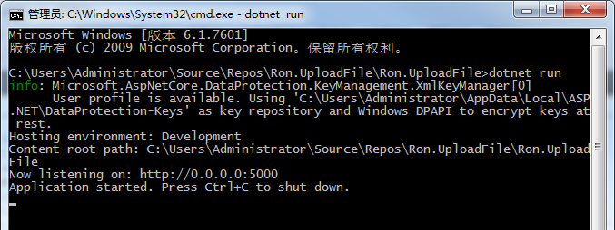
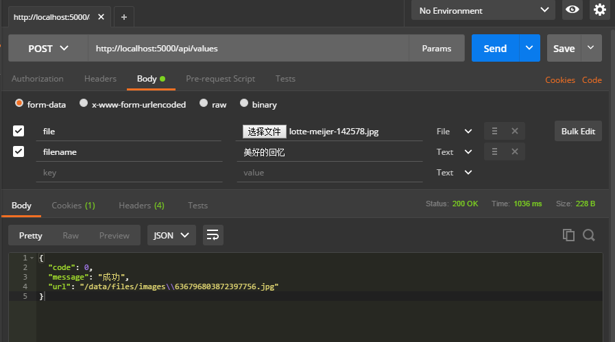
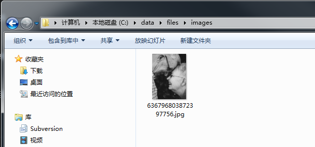

Asp.Net Core 轻松学-一行代码搞定文件上传
前言
    在 Web 应用程序开发过程中，总是无法避免涉及到文件上传，这次我们来聊一聊怎么去实现一个简单方便可复用文件上传功能；通过创建自定义绑定模型来实现文件上传。

1. 实现自定义绑定模型
1.1 在 Asp.Net Core MVC 中，内置了很多种绑定模型，让我们可以很方便的去使用，比如下面常用的几种绑定模型
 FromBodyAttribute
 FromFromAttribute
 FromQueryAttribute
 FromHeaderAttribute
 FromServicesAttribute
 FromRouteAttribute
常见用法比如
    [HttpPost]
     public async Task<IActionResult> PostInfo([FromBody]UserInfo user,[FromQuery] string city)
    {
        ...
    }
查看以上绑定模型，唯独缺少一个 FromFileAttribute ，下面就来实现一个自己的 FromFileAttribute
    public class FromFileAttribute : Attribute, IBindingSourceMetadata
    {
        public BindingSource BindingSource => BindingSource.FormFile;
    }
非常简单，就三行代码，完全照抄系统内置的绑定模型，唯一不同的就是指定 BindingSource 为 BindingSource.FormFile。
2. 实现一个上传文件实体类，专门用于接收客户端参数
2.1 创建 UserFile
public class UserFile
    {
        public string FileName { get; set; }
        public long Length { get; set; }
        public string Extension { get; set; }
        public string FileType { get; set; }

        private readonly static string[] Filters = { ".jpg", ".png", ".bmp" };
        public bool IsValid => !string.IsNullOrEmpty(this.Extension) && Filters.Contains(this.Extension);

        private IFormFile file;
        public IFormFile File
        {
            get { return file; }
            set
            {
                if (value != null)
                {
                    this.file = value;

                    this.FileType = this.file.ContentType;
                    this.Length = this.file.Length;
                    this.Extension = this.file.FileName.Substring(file.FileName.LastIndexOf('.'));
                    if (string.IsNullOrEmpty(this.FileName))
                        this.FileName = this.FileName;
                }
            }
        }

        public async Task<string> SaveAs(string destinationDir = null)
        {
            if (this.file == null)
                throw new ArgumentNullException("没有需要保存的文件");

            if (destinationDir != null)
                Directory.CreateDirectory(destinationDir);

            var newName = DateTime.Now.Ticks;
            var newFile = Path.Combine(destinationDir ?? "", $"{newName}{this.Extension}");
            using (FileStream fs = new FileStream(newFile, FileMode.CreateNew))
            {
                await this.file.CopyToAsync(fs);
                fs.Flush();
            }

            return newFile;
        }
    }
UserFile 是一个带保持文件行为的实体类，该类的公共属性用于从表单域中接收和属性名称相同的表单值，其中公共属性 File 用于接收文件，并在设置值的时候去做一些其它属性初始化的工作，比如文件长度和扩展名、文件类型
其中还实现了一个简单的文件过滤器，判断客户端上传的文件是否属于服务端允许上传的文件扩展名
最后 SaveAs(string destinationDir = null) 通过传入指定目录，将文件保存，并返回保存后的文件绝对路径
3. 上传文件
3.1 下面就定义一个简单的 API 接口，用于测试上传文件
        [HttpPost]
        public async Task<IActionResult> Post([FromFile]UserFile file)
        {
            if (file == null || !file.IsValid)
                return new JsonResult(new { code = 500, message = "不允许上传的文件类型" });

            string newFile = string.Empty;
            if (file != null)
                newFile = await file.SaveAs("/data/files/images");

            return new JsonResult(new { code = 0, message = "成功", url = newFile });
        }
3.2 首先是在 Post([FromFile]UserFile file) 中使用上面创建的 FromFileAttribute 对模型 UserFile 进行绑定，然后验证文件是否正确，接下来通过 file.SaveAs("/data/files/images"); 保存文件

3.3 上传代码非常简单，几乎到了无法精简的程度，最终发挥作用的就是 file.SaveAs 操作

4. 上传测试
4.1 现在通过控制台启动服务

4.2 使用 Postman 模拟表单上传文件

4.3 上传成功，现在来查看目录下是否有文件

结语
在上传表单中，我们定义了附件的名称为 file 对应绑定模型的公共属性 File，这样模型就可以自动获得该文件
表单中还传递了另外一个字段 filename,对应绑定模型的公共属性 FileName,实现自定义文件友好显示名称
通过自定义模型绑定，实现了快速上传文件功能，该功能只能用于上传小文件，对于大文件，还是需要实现分片上传，或者使用 CDN 等服务商的接口
示例代码下载
https://files.cnblogs.com/files/viter/Ron.UploadFile.zip