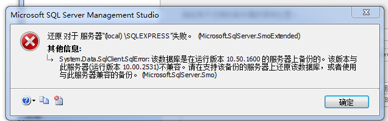
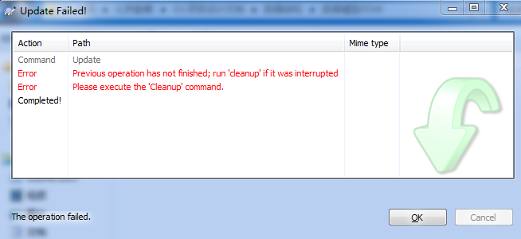
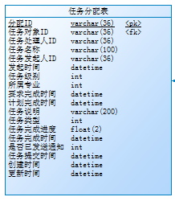
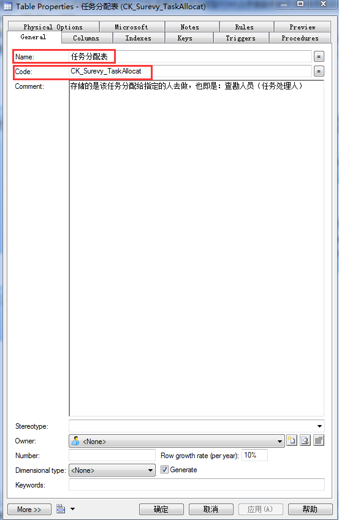
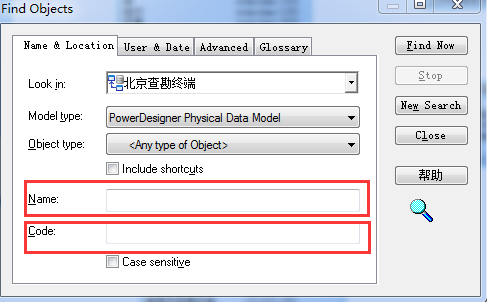

###1.MicrosoftSqlServer如何还原数据库.bak备份文件

右键选择系统数据库，并点击弹出菜单中的“还原数据库”  
MicrosoftSqlServer如何还原数据库.bak备份文件  
在弹出的 还原数据库 对话框中  
MicrosoftSqlServer如何还原数据库.bak备份文件  
 点击设备，并点击右侧的 ...
MicrosoftSqlServer如何还原数据库.bak备份文件  
选择添加  
MicrosoftSqlServer如何还原数据库.bak备份文件  
找到自己的备份文件  
MicrosoftSqlServer如何还原数据库.bak备份文件  
确认后核对信息  
MicrosoftSqlServer如何还原数据库.bak备份文件  
成功还原  
MicrosoftSqlServer如何还原数据库.bak备份文件步骤阅读  

###2.标题: Microsoft SQL Server Management Studio
------------------------------

还原 对于 服务器“(local) \SQLEXPRESS”失败。  (Microsoft.SqlServer.SmoExtended)

System.Data.SqlClient.SqlError: 该数据库是在运行版本 10.50.1600 的服务器上备份的。该版本与此服务器(运行版本 10.00.2531)不兼容。请在支持该备份的服务器上还原该数据库，或者使用与此服务器兼容的备份。 (Microsoft.SqlServer.Smo)

解决办法：
10.50.1600是SQL Server 2008 R2，你安装R2然后进行还原。

###3.vs显示行号对齐的辅助线（虚线）
从“编辑”菜单中选择“高级”，然后选择“查看空白”，取消编辑器对空白字符的显示

###4.VS设置护眼背景颜色
打开VS —> 工具 —> 选项 —> 环境 —> 字体和颜色 —> 纯文本（显示项中） —> 项目背景 —> 自定义—> 色调位85、饱和度123、亮度205，保存即可。测试了一下VS2010同样试用，估计其他版本的也都是一样的设置方法。

###5.附加数据库时提示错误

附加数据库时出错。有关详细信息，请单击“消息”列中的超链接。

提高数据库的权限为完全控制。

###6.Previous operation has not finished; run 'cleanup' if it was interrupted.Please execute the 'Cleanup' command.

一、SVN 中 clean up 的功能
当Subversion改变你的工作拷贝(或是.svn中的任何信息)，它会尽可能的小心，在修改任何事情之前，它把意图写到日志文件中去，然后执行log文件中的命令，并且执行过程中在工作拷贝的相关部分保存一个锁，防止Subversion客户端在变更过程中访问工作拷贝。如果Subversion的操作中断了（举个例子：进程被杀死了，机器死掉了），日志文件会保存在硬盘上，通过重新执行日志文件，Subversion可以完成上一次开始的操作，你的工作拷贝可以回到一致的状态。

这就是svn clean up所作的：它查找工作拷贝中的所有遗留的日志文件，删除进程中工作拷贝的锁。如果Subversion告诉你工作拷贝中的一部分已经“锁定”了，你就需要运行这个命令了。

二、本地文件锁定，使用“清除”命令  
SVN本地更新时，由于一些操作中断，如磁盘空间不够，用户取消等，可能会造成本地文件被锁定的情况。这时候无论你在执行SVN的更新、上传、添加等子命令都会提示“**locked”的错误，如图：
 
一般出现这种情况的解决方法：  
１、可以使用SVN clean up来清除锁定。  
２、如果不是本目录锁定，系统提示上一层目录锁定，需要到上一层或者根目录中清除。  
３.如果在根目录下都无法clean的话，一般采取的方法是另外找一个目录重新CHECKOUT。但有时有时SVN目录下可能有一些自己本地修改的文件，还未提交到SVN服务器，这时重新CHECKOUT需要注意本地文件的备份，并且不要强制覆盖服务器上其它人修改的内容。  
４.其实SVN加锁会在.SVN（隐藏文件）中生成一个名字叫lock的文件（无后缀），查找所有的，手工删除。然后再尝试更新，系统可能会提示某个.base文件无法访问。找到它，把相关的文件或其所在的目录删除，重新UPDATE。  
5.在相应的目录中，比如我在更新metasploit的“/opt/metasploit3/msf3/lib/active_support/core_ext”这个目录时就遇到了类似的情况，把.SVN子目录里(注意，“.”目录是个隐藏目录，需要选择“文件夹选项”→“查看”→“显示隐藏文件”菜单项)面log文件删除，就可以了。然后继续做svn cleanup命令。     
第4种和第5种方式，未找到相关locked文件 和 log文件，不知道是不是SVN版本的问题。本地文件加锁，“清除命令clean up”很好使。  
要清理的文件夹或者文件上点右键，菜单：TortoiseSVN----清理

###6.PowerDesigner查找指定的表
今天首次用powerdesigner,里面有很多表。我需要找到指定的表，但里面有很多很多表，应该怎么找？
例如我要查找Name:任务分配表,Code:CK_Surevy_TaskAllocat的表  
  
   
方法如下：
快捷键：Crtl+F，打开Find Objects,如果知道指定表的Code值或者Name值，Code处输入Code值或者Name处输入Name值，然后点击“Find Now"就可以了。
   